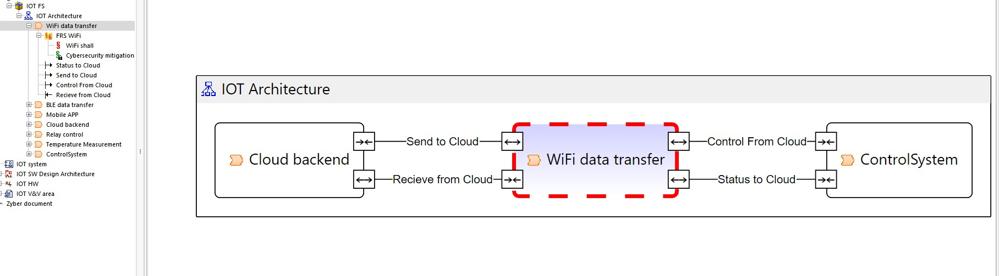

# zybersecurity
How to work with Systemweaver and cybersecurity with our metamodel iTool

The workflow to have an good analyze for cybersecurity and even functionalsafety is to define your product. 
1. Define your system and an good start is to create "Functional architecture"

1.1. Define the interfaces to other functions
1.2. Define the requirements for the function and here will we later add the Cybersec REQs

